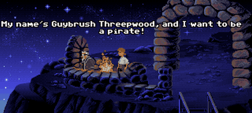

---
author:
- Irene Pérez, Carlos Borrego, Eloi Puertas
date: Febrer 2021
title: Pràctica 1 - Client Servidor (Software distribüit)
---



Objectiu
========

L'objectiu docent de la pràctica és aprendre a utilitzar els mecanismes
de programació Client/Servidor en JAVA. Concretament és necessari que
aprengueu com programar amb:

-   Sockets amb JAVA (utilitzant l'API Socket de Java.net)

-   Servidor multi-petició amb threads (JAVA)

Tasques a realitzar
===================

-   El client ha de tenir un mode manual (menú per pantalla) i un mode
    automàtic (juga automàticament segons els paràmetres introduïts)

-   S'ha de fer una implementació del servidor multi-thread que tant
    serveixi per a que el jugador jugui contra la *màquina* (1 player)
    (Especificació 1 player v0.1) com per a que jugui contra un altre
    client connectat (2 player) (Variant 2 players v0.1)

-   El servidor ha d'escriure un log de l'interacció amb el client a
    fitxer seguint el format especificat.

-   Fer proves de robustesa i d'estrès del sistema.

-   Realitzar codi, Junit, JavaDoc, dossier amb Diagrames i
    autoevaluació de la pràctica.

Calendari
=========

-   xx/xx/2021: a) Creació de grups. b) Preparació del GitHub. c)
    Realiztizació de la prac0

-   xx/xx/2021 Disseny del sistema distribuït. Implementació Protocol.

-   xx/xx/2021 Implementació Client.

-   xx/xx/2021 Implementació Servidor amb Multithread 1 Player.

-   xx/xx/2021 Implementació Servidor amb Multithread 2 Players.

-   xx/xx/2021 Sessió de Test creuat.

-   xx/xx/2021 Entrega codi, dossier i log execució al CV.

Notes importants
================

-   No es demana que s'implementi cap interfície gràfica.

-   En mode manual l'usuari ha de poder jugar tantes partides com
    vulgui. Haurà d'introduir el seu Identificador de jugador i a
    continuació podrà fer tantes partides com vulgui o pugui. En cas de
    no tenir suficients diners per entrar a una partida haurà de sortir.

-   S'haurà de poder sortir en qualsevol moment de la partida, tallant
    la comunicació amb el servidor. La partida però serà contada com a
    perduda i s'esborrarà del seu crèdit tots els diners apostats fins
    llavors.

-   En cada sessió de pràctiques es comprovarà si s'ha arribat a
    l'objectiu fixat en el calendari per la sessió anterior. Feu un bon
    ús de la programació Orientada a Objectes i de la metodologia
    Test-Driven Development. Es penalitzarà si no es fa un bon ús
    d'interfícies JAVA, separació de responsabilitats i creació de
    tests.

Notes sobre el Disseny
======================

-   Recordeu que s'han de dissenyar dues aplicacions, Client i Servidor.
    Poden tenir classes en comú, per exemple ComUtils.

-   La classe ComUtils l'heu d'extendre amb els vostres mètodes per a
    seguir fil per randa el protocol. Si hi ha mètodes que no els
    necessiteu, els podeu esborrar.

-   No podeu usar classes de Java per a serialitzar els vostres
    objectes, ja que no seguiran el protocol demanat. Useu les
    primitives del ComUtils sempre.

-   Feu servir JUnit per comprovar el protocol, per exemple, si s'ha
    enviat una comanda, espero rebre'n unes de determinades. Penseu que
    sempre podríeu rebre un missatge d'error.

-   Per a guardar les comandes d'entrada és una bona pràctica usar un
    HashMap per cada opció entrada i el seu valor i consultar el seu
    valor quan sigui necessari.

-   El Client en mode automàtic ha de prendre les decisions més adients
    per guanyar la partida.

-   Feu servir dues implementacions diferents del thread de control de
    la partida del Servidor pel cas 1 player i 2 player. En l'execució
    s'especificarà el mode de joc del Servidor.

Execució
========

    servidor> java Server -h 
    Us: java Server -p <port> -m [1|2] 


    client> java Client -h
    Us: java Client -s <maquina\_servidora> -p <port> [-i 0|1]

-   En el servidor s'especifica l'opció port (-p) on s'especificarà el
    port d'escolta i s'especifica l'opció mode (-m) on s'especificarà si
    es jugarà en mode 1 player o mode 2 players

-   En el client s'especifica l'opció maquina seridora (-s) on
    s'especificarà la IP del servidor i l'opció port (-p) on
    s'especificarà el port d'escolta del servidor.

-   Si en el client també s'especifica l'opció interactive (-i) igual a:

    -   0 vol dir que el joc s'executa en mode manual.

    -   1 s'executarà en mode automàtic prenent decisions.

-   Si no s'especifica, el mode per defecte és el manual.

Sortida demanada
================

-   El fitxer de log ha de ser la versió textual del que s'està enviant
    pel socket.

-   Només cal guardar el fitxer de log del Servidor. Heu de guardar
    només el contingut de la comunicació per socket, tant del que es rep
    com el que s'està enviant. En cas de que hi hagi un error també heu
    de guardar el missatge que s'enviï o que es rebi pel socket.

-   El nom del fitxer de log l'heu de construir de la següent forma:

-   \"Server\"+Thread.currentThread().getName()+\".log\"

-   Sobretot feu una carpeta src per cada aplicació on les classes
    principals es diguin Clienti Server respectivament.

Entregues
=========

-   Actualitzar codi a Github cada cop que es treballa amb la pràcitca.

-   Sessió Presencial de Test obligatòria (Mínim un component de la
    parella).

-   A CampusVirtual: 24/03/2019 23.55h.

Avaluació
=========

-   En cas de que el codi no compleixi les especificacions determinades
    o no segueixi el protocol acordat, la pràctica estarà suspesa. Totes
    les entregues s'executaran de forma automàtica contra els nostres
    servidors i clients amb diferents jocs de proves escrits en JUnit.
    Es recomana que feu els vostres propis JUnit per provar el vostre
    codi amb els demés en la sessió de test.

-   En cas de que es superi tot el conjunt de proves satisfactòriament
    es ponderarà de la següent forma:

    -   10% Javadoc i Diagrames

    -   20% Autoavaluació

    -   10% Junit

    -   60% Codi (Sense bugs, 1 client i servidor en els modes)

Batalla d'insults
=================

La batalla d'insults d'espasa és una activitat que tot pirata ha de
dominar. A tot el Carib, molts pirates fan servir insults estàndards.
Durant les baralles un pirata llançarà un insult com ara *\"¿Has dejado
ya de usar pañales?\"*. L'adversari es veurà obligat a respondre amb una
resposta enginyosa, per exemple *\"¿Por qué? ¿Acaso querías pedir uno
prestado?\"*. Si la resposta és prou insultant guanyarà la baralla. Qui
mantingui el domini podrà llançar el següent insult. Dos insults amb
èxit asseguraran la victòria dels combatents. L'objectiu del jugador és
estar preparat per derrotar la Sword Master de la illa Mêlée com un dels
tres assajos per demostrar-se digne de convertir-se en pirata.

El jugador comença amb dos insults/rèpliques que ha après anteriorment i
hi ha una llista de 16 (veure secció
[\[sec:instults\]](#sec:instults){reference-type="ref"
reference="sec:instults"}). Després d'aprendre al menys 4 parelles
d'insults/rèpliques i guanyar al menys 3 duels (per guanyar un duel has
de guanyar 2 vegades al pirata, bé insultant sense que aconsegueixi
replicarte, o bé replicant correctament els seus insults). Quan això
passi els teus enemics et diran que ets tan bo que podries lluitar amb
la Sword Master de la illa Mêlée. Aquí donem per acabat el joc.

Insults {#sec:insults}
=======

Aquí teniu la llista d'insults estàndards del Carib.

-   **Insult**: ¿Has dejado ya de usar pañales?

    **Rèplica**: ¿Por qué? ¿Acaso querías pedir uno prestado?

-   **Insult**: ¡No hay palabras para describir lo asqueroso que eres!

    **Rèplica**: Sí que las hay, sólo que nunca las has aprendido.

-   **Insult**: ¡He hablado con simios más educados que tu!

    **Rèplica**-- Me alegra que asistieras a tu reunión familiar diaria.

-   **Insult** : ¡Llevarás mi espada como si fueras un pincho moruno!

    **Rèplica**: Primero deberías dejar de usarla como un plumero.

-   **Insult**: ¡Luchas como un ganadero!

    **Rèplica**: Qué apropiado, tú peleas como una vaca.

-   **Insult**: ¡No pienso aguantar tu insolencia aquí sentado!

    **Rèplica**-- Ya te están fastidiando otra vez las almorranas, ¿Eh?

-   **Insult**: ¡Mi pañuelo limpiará tu sangre!

    **Rèplica**-- Ah, ¿Ya has obtenido ese trabajo de barrendero?

-   **Insult**: ¡Ha llegado tu HORA, palurdo de ocho patas!

    **Rèplica** Y yo tengo un SALUDO para ti, ¿Te enteras?

-   **Insult**: ¡Una vez tuve un perro más listo que tu!

    **Rèplica**-- Te habrá enseñado todo lo que sabes.

-   **Insult**: ¡Nadie me ha sacado sangre jamás, y nadie lo hará!

    **Rèplica**-- ¿TAN rápido corres?

-   **Insult**: ¡Me das ganas de vomitar!

    **Rèplica**-- Me haces pensar que alguien ya lo ha hecho.

-   **Insult**: ¡Tienes los modales de un mendigo!

    **Rèplica**-- Quería asegurarme de que estuvieras a gusto conmigo.

-   **Insult**: ¡He oído que eres un soplón despreciable!

-   **Rèplica**-- Qué pena me da que nadie haya oído hablar de ti

-   **Insult**: ¡La gente cae a mis pies al verme llegar!

    **Rèplica**-- ¿Incluso antes de que huelan tu aliento?

-   **Insult**: ¡Demasiado bobo para mi nivel de inteligencia!

    **Rèplica**-- Estaría acabado si la usases alguna vez.

-   **Insult**: Obtuve esta cicatriz en una batalla a muerte!

    **Rèplica**-- Espero que ya hayas aprendido a no tocarte la nariz.

Missatges
=========

El client (c) i el servidor (s) suporta 7 tipus de missatges amb els
següents codis d'operacions:

  ---------- ---
  HELLO      1
  HASH       2
  SECRET     3
  INSULT     4
  COMEBACK   5
  SHOUT      6
  ERROR      7
  ---------- ---

-   La capçalera d'un missatge conté el codi d'operació associat amb
    aquest paquet. Els paquets HELLO (codi d'operació 1) té el format
    que es mostra en la Figura 1, on *Name* és el nom del pirata.

```{=html}
<!-- -->
```
                                 1 byte       string    1 byte     
                                ------------------------------
                                | Opcode |     Name    |  0  |
                                ------------------------------
                                    Figura 1: Missatge HELLO

-   Els paquets HASH i SECRET (codi d'operacions 2 i 3 respectivament)
    tenen el format que es mostra en la Figura 2, on *Hash* és el hash
    creat pel pirata i *Secret* és el secret fet servir pel pirata.

```{=html}
<!-- -->
```
                                 1 byte       string      1 byte     
                                ---------------------------------
                                | Opcode |  Hash/Secret   |  0  |
                                ---------------------------------
                                 Figura 2: Missatges HASH i SECRET

-   Els paquets INSULT i COMEBACK (codi d'operacions 4 i 5
    respectivament) tenen el format que es mostra en la Figura 3, on
    *Insult* és un insult devastador i *Comeback* és la rèplica a
    l'insult devastador. La llista dels possibles insults la podeu
    trobar en la secció [11](#sec:insults){reference-type="ref"
    reference="sec:insults"}.

```{=html}
<!-- -->
```
                                 1 byte       string          1 byte     
                                -------------------------------------
                                | Opcode |  Insult/Comeback   |  0  |
                                -------------------------------------
                                 Figura 3: Missatges HASH i SECRET

-   Els paquets SHOUT i ERROR (codi d'operacions 6 i 7 respectivament)
    tenen el format que es mostra en la Figura 4, on
    *EndMessage/ErrorMessage* és el és el missatge final i
    *ErrorMessage* el missatge d'error.

```{=html}
<!-- -->
```
                             1 byte              string           1 byte     
                            ---------------------------------------------
                            | Opcode |  EndMessage/ErrorMessage   |  0  |
                            ---------------------------------------------
                                 Figura 4: Missatges SHOUT i ERROR

Els possibles missatges d'error són:

-   ¡ Código de operación inválido, marinero de agua dulce! ¡Hasta la
    vista!

-   ¡Mensaje incompleto, grumete! ¡Hasta la vista!

-   ¡Me he candado de esperar tus mensajes, mequetrefe! ¡Hasta la
    vista!

Protocol
========

El pirates comencen triant de manera segura qui comença a insultar. El
Carib està ple de monedes amb dues cares, per això, els pirates no
confien en elles i prefereixen implementar protocols criptogràfics. Fa
uns anys per triar qui comença a insultar cada pirata pensava en un
secret i se'ls intercanviaven. Si la suma dels secrets era parell
començava el pirata client, en un altre cas, començava el pirata
servidor. És conegut a tot el Carib el *truco* del pirata Trump Oso pel
qual en rebre el secret del seu adversari triava un secret de tal manera
que li permetès escollir qui començava. Per evitar aquest *truco* els
pirates fan servir un protocol de *commitment* [^1]. En comptes de
enviar directament els seus secrets, els pirates envien abans, com a
compromís, un hash del seu secret de tal manera que no es pugui fer el
*truco* del pirata Trump Oso.

Les funcions hash són funcions matemàtiques que assignen a qualsevol
entrada de qualsevol mida una cadena de bits de mida constant. Al Carib
es fa servir *SHA-256* de 256 bits[^2]. Aquestes funcions són
unidireccionals d'un sol sentit, es a dir, aplicant la funció hash a una
entrada qualsevol obtindrem sempre la mateixa sortida, però donada
aquesta sortida no podrem obtenir l'entrada corresponent.

Una vegada rebut el hash del secret del seu adversari, els pirates ja
poden revelar els seus secrets i posteriorment calcular la seva suma.
Els pirates, per estar segurs que no han fet trampa calculen ells
mateixos el hash del secret del seu adversari. Si coincideix amb el hash
previament rebut ja poden calcular qui comença a insultar que es fa com
abans: si la suma és parell comença el pirata client, en un altre cas,
comença el pirata servidor.

Per començar els pirates es presenten fent servir el missatge de tipus
HELLO amb el seu nom:

    c: HELLO Name1 

De la mateixa manera, el pirata servidor contestarà:

    s: HELLO Name2

Els pirates client i servidor crearan un nombre secret (secret_c i
Secret_s, respectivament) i s'intervanviaran els següents missatges:

    c: HASH h(secret_c)
    s: HASH h(secret_s)

Una vegada els dos hashos hagin sigut compartits els pirates poden
revelar els seus secrets:

    c: SECRET secret_c
    s: SECRET secret_s

Si la suma dels seus secrets és parell comença el pirata client, en un
altre cas, comença el pirata servidor. El client i el servidor comencen
amb la batalla:

    c/s: INSULT: Quería asegurarme de que estuvieras a gusto conmigo.
    s/c: COMEBACK: !`He oído que eres un soplón despreciable!

Qui mantingui el domini podrà llançar el següent insult. Com es deia
anteriorment, dos insults amb èxit asseguraran la victòria dels
combatents. La batalla acaba fent servir el missatge de tipus SHOUT:

    c: SHOUT !`He ganado, Name2!
    s: SHOUT !`Has ganado, Name1!

Si ocorregués qualsevol problema al protocol els pirates faran servir el
missatge de tipus ERROR i la lluita s'acabarà:

    c/s: ERROR !` Código de operación inválido, marinero de agua dulce! !`Hasta la vista!

[^1]: Veure: *https://en.wikipedia.org/wiki/Commitment_scheme*

[^2]: Mireu: *https://www.baeldung.com/sha-256-hashing-java*
